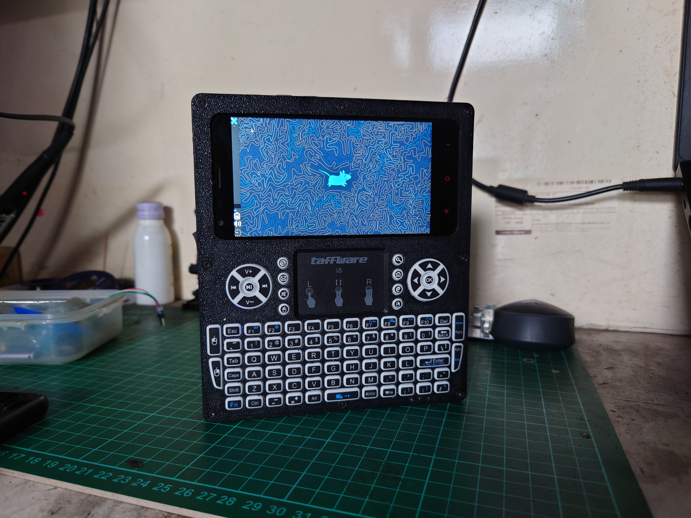
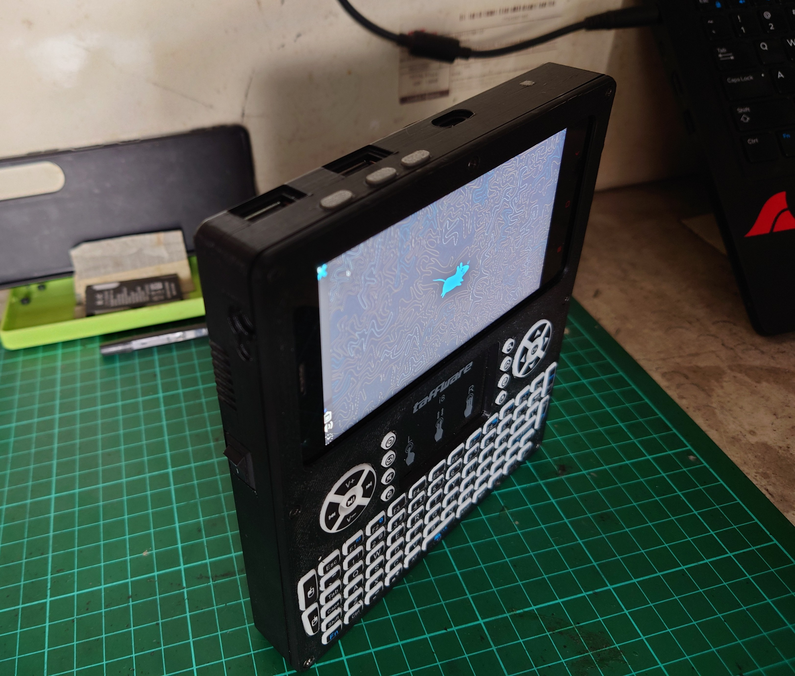

# HaPlay GO Zero 2

HaPlay GO Zero 2 adalah model ke-dua yang dibuat berdasarkan dari model pertama, yaitu [HaPlay GO Zero 1](https://github.com/dhocnet/haplay-go-zero-1), dengan perbedaan utamanya adalah pada keyboard yang digunakan.

## Apa Ini?
HaPlay GO Zero 2 adalah poket komputer Linux yang bekerja penuh layaknya sebuah komputer pada umumnya, namun dengan ukuran yang sangat kompak. HaPlay GO Zero 2 dilengkapi dengan dua port USB 2.0 untuk ekspansi dan USB Type-C untuk charging baterai berjenis polimer dengan kapasitas 4855maH. Sebagai perangkat masukan, HaPlay GO Zero 2 menggunakan keyboard fisik QWERTY yang dilengkapi dengan touchpad dan touchscreen sebagai perangkat masukan opsional.

HaPlay GO Zero 2 dirakit menggunakan mesin smartphone bekas, yaitu Xiaomi Redmi 2.

## Untuk Apa Ini?
HaPlay GO Zero 2 merupakan salah satu produk yang diproduksi oleh proyek [HaPlay Computer](https://dhocnet.work/p/haplay.html), dimana proyek ini, bertujuan untuk menggunakan ulang elektronik konsumen yang sudah tidak terpakai sebagai produk baru dengan fungsi yang berbeda guna turut dalam program *Reuse & Recycle* untuk mengurangi menumpuknya sampah elektronik, khususnya yang berjenis smartphone.

## Apa Fungsi HaPlay GO Zero 2?
Seperti yang telah disebutkan sebelumnya, HaPlay GO Zero 2 adalah poket komputer yang berfungsi layaknya komputer pada umumnya. Sehingga dapat digunakan untuk banyak hal terutama untuk kebutuhan edukasi.

Beberapa contoh penggunaannya adalah, untuk memperdalam kemampuan logika dan objek dalam bahasa pemrograman komputer, menulis dan administrasi sistem operasi Linux.

HaPlay GO Zero 2 menggunakan sistem operasi [PostmarketOS Linux](https://postmarketos.org) yang memiliki repository yang sangat besar, yang didalamnya termasuk paket-paket program untuk pengembangan. Seperi Python, GCC, NodeJS, GOlang dan sebagainya.

Untuk menulis, ada banyak editor teks yang tersedia. Seperti **Nano Editor**, **Micro Editor**, **Vim/ NVim**, **Emacs** dan **LYX**.

Dan karena sistem operasi default HaPlay GO Zero 2 adalah Linux, maka perangkat ini dapat digunakan sebagai mini lab untuk mengasah kemampuan dalam membangun server berbasis Linux, mengasah kemampuan administrasi sistem Linux, atau hanya untuk sebagai personal terminal.

## Bagaimana Cara Membuatnya?
Lihat dokumentasi cara merakit HaPlay GO Zero 2: [Disini](diagram/README.md)

## Dimana Membelinya?
HaPlay GO Zero 2 tersedia untuk dibeli secara langsung melalui [DHOCNET Store](https://dhocnet.work/search?label=Produk) atau melalui Rekening Bersama Tokopedia di [DHOCNET Store Tokopedia](https://tokopedia.com/dhocnet) dengan tambahan beban biaya transaksi sebesar 12%.

Dengan membeli produk HaPlay Computer melalui toko tersebut, kalian telah turut andil dalam kelanjutan pengembangan proyek dan program *Reuse & Recycle* elektronik konsumen.
